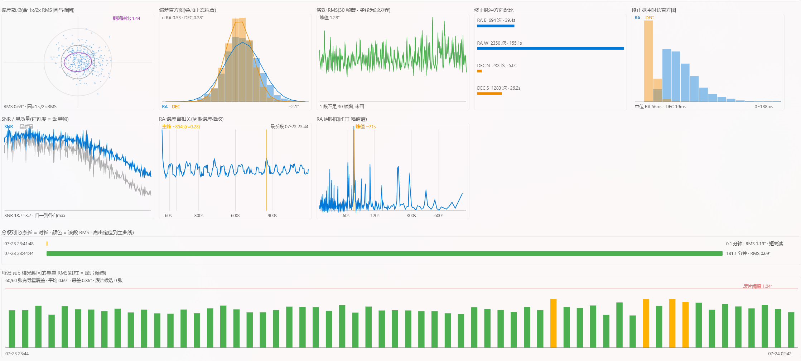

# Astro SMB Tool

[中文](#中文) · [English](#english)

> 我其实做这个软件的初衷很简单：我没办法在 Windows 上直接打开 ZWO 的 SMB
> 共享，又不想改 Windows 设置，于是就想着写一个文件传输工具。没想到写着写着，
> 总想再加一个功能、再加一个功能……现在就成这样了。

> This project started for a very simple reason: I could not open ZWO's SMB share
> directly on Windows, and I did not want to change my Windows settings. So I
> planned to build a small file-transfer tool. Then I kept thinking of one more
> feature, and one more after that... and this is what it has become.

Astro SMB Tool 是一个面向天文摄影工作流的 SMB 文件管理、FITS 查看与拍摄日志分析工具。
当前版本优先适配 ASIAIR 的共享目录与日志格式，但软件本身是独立项目，并非 ZWO 产品。

Astro SMB Tool is an SMB file manager, FITS viewer, and imaging-log analyzer for
astrophotography workflows. The current version primarily supports ASIAIR shares
and log formats, but this is an independent project and is not a ZWO product.



## 中文

### 主要功能

- **不改 Windows 策略直接连接 SMB**：使用 `impacket` 连接 SMB 2/3，不需要为匿名
  Guest 共享修改系统策略，也不依赖 SMB1。
- **完整文件管理**：浏览、搜索、上传、下载、续传、取消、并发分块传输、拖放、
  目录占用统计和传输队列。
- **设备与存储发现**：扫描局域网 SMB 设备，也能识别直接插入电脑的天文设备存储卡。
- **低开销 FITS 工作流**：读取 FITS 头、缩略图和彩色拉伸预览；提供全分辨率查看、
  星点检测、WCS 与本地星表辅助解算。
- **拍摄记录还原**：解析 Autorun 与 PHD2 日志，按夜次、计划和目标重建时间线，
  汇总曝光、滤镜、自动对焦、自动居中和导星覆盖。
- **导星质量分析**：既可从导星日志分析，也可从拍摄结果反推星点形状、帧间漂移与
  场旋；可从拍摄记录和 3D 天球中的目标触发。
- **3D 天球与拍摄足迹**：查看目标在实际拍摄时段内的位置、指向和画幅覆盖；选中
  目标时，时刻轴会限制在该目标真实拍摄区间。
- **空间分析**：用 treemap 和目录树查看存储占用，快速找到大文件与大目录。

### 当前状态

两套界面都可用：

- **PySide6 / Qt 版**（`astro-smb-tool-qt`）—— Windows / macOS / Linux 通用，
  是跨平台交付的那一套。九页逐页复刻 WinUI 3 版做出来，验收清单见
  [`docs/qt-final.md`](docs/qt-final.md)。
- **WinUI 3 原生 Windows 版**（`astro-smb-tool-gui`）—— 需要 Windows 10 21H2+
  与 Windows App Runtime 2.3。它是原生体验，也是**界面原型**：新界面先在这里
  成形，再同步到 Qt。

界面支持中文与英文，启动时按系统语言选择，也可以在界面里手动切换（切换需要
重启，会在对话框里说明）。翻译本身仍在进行中。

项目仍处于早期阶段，界面、配置格式和命令行参数都可能变化。

Python 要求为 3.13，依赖使用 [uv](https://docs.astral.sh/uv/) 管理。

### 安装与运行

```bash
git clone <repository-url>
cd astro-smb-tool
uv sync

# 跨平台界面（Windows / macOS / Linux）
uv run astro-smb-tool-qt

# Windows 原生界面（需要 Windows App Runtime）
uv run --extra winui astro-smb-tool-gui
```

**不给地址时会自动扫描本网段找设备** —— 不假设任何默认 IP。也可以手动输入
设备地址、本地盘符或本地目录（ZWO 卡直插电脑时走的是同一条代码路径）。

macOS 上从头开始的完整步骤见 [`START-HERE-macOS.md`](START-HERE-macOS.md)。

### CLI

远程路径格式为 `"共享名/目录/文件"`。共享名含空格时请保留引号。

```powershell
# 查看服务器与共享
uv run astro-smb-tool -H 192.168.x.x info
uv run astro-smb-tool -H 192.168.x.x shares

# 浏览、搜索和读取 FITS 头
uv run astro-smb-tool -H 192.168.x.x ls "EMMC Images/Autorun" -l
uv run astro-smb-tool -H 192.168.x.x find "EMMC Images" "*.fit" --limit 50
uv run astro-smb-tool -H 192.168.x.x header "EMMC Images/Autorun/Light/example.fit"

# 下载与上传
uv run astro-smb-tool -H 192.168.x.x get "EMMC Images/Autorun/Light" D:/astro/ --resume
uv run astro-smb-tool -H 192.168.x.x put D:/astro/plan.txt "EMMC Images/Plan"

# 容量与目录占用
uv run astro-smb-tool -H 192.168.x.x df
uv run astro-smb-tool -H 192.168.x.x du "EMMC Images/Autorun" -c
```

也可以用环境变量 `ASTRO_SMB_HOST` 设置默认设备地址。

### 可选星表

本地板解算需要 Tycho-2 打包星表（35.6 MB）。**界面上点「下载星表」就行** ——
没有打包镜像可下时，它会直接从上游 CDS I/259 取原始数据在本地构建完，不需要
任何额外配置。

想自己指定一份现成的：

```bash
uv run python -m astro_smb.catalog_build --download --out tycho2_v1.bin
export ASTRO_SMB_CATALOG_PATH="$PWD/tycho2_v1.bin"      # Windows: $env:...
```

星表较大，不要提交到 Git 仓库。

### 路线图

- **补齐翻译**：i18n 的机制与词表（1900 余条）已经就位，界面也能切换语言，
  但英文译文才刚起步。词汇表见 [`docs/i18n-glossary.md`](docs/i18n-glossary.md)。
- **签名与公证**。三平台四架构的免安装包已经能打了(`.github/workflows/release.yml`,打 tag 触发),但**都没签名**。macOS 包发的是 `.tar.gz`,终端里解开不会被 Gatekeeper 拦(访达里解的话要 `xattr -dr com.apple.quarantine`);Windows 上 SmartScreen 会提示一次,点「仍要运行」即可。产物随附 SHA-256 与 GitHub 构建来源证明。
- 尝试支持更多天文自动化工具的日志与目录结构，例如 **Astroberry** 等。
- 继续完善设备适配、FITS 分析、板解算和导星质量诊断。

### 开发

```powershell
uv sync
uv run pytest tests/ -q
```

项目的线程模型、win32more/WinUI 3 约束、缓存设计和真机行为记录在
[`docs/DEVELOPMENT.md`](docs/DEVELOPMENT.md) 中。

### 许可与声明

本项目采用 [MIT License](LICENSE)。

ASIAIR、ZWO 以及其他产品或项目名称归各自权利人所有，仅用于说明兼容性。
本项目与这些厂商或项目没有隶属、授权或背书关系。可选巡天底图、星表及其他第三方
数据仍遵循各自的许可证和使用条款。

---

## English

### Highlights

- **Direct SMB access without changing Windows policy**: connects through
  `impacket` over SMB 2/3, without enabling insecure Guest access or SMB1.
- **Full file management**: browse, search, upload, download, resume, cancel,
  parallel chunked transfers, drag and drop, storage analysis, and a transfer queue.
- **Device and storage discovery**: scans SMB devices on the LAN and recognizes
  supported astronomy storage cards connected directly to the computer.
- **Lightweight FITS workflow**: reads FITS headers and thumbnails, generates
  color-stretched previews, and provides a full-resolution viewer with star
  detection, WCS tools, and optional local-catalog plate solving.
- **Imaging-session reconstruction**: parses Autorun and PHD2 logs, rebuilding
  nights, plans, targets, exposure timelines, filters, autofocus, autocenter,
  and guiding coverage.
- **Guiding-quality analysis**: analyzes guiding logs and can also infer image
  quality, frame-to-frame drift, and field rotation from captured frames. The
  analysis can be launched from either an imaging record or a target in the 3D sky.
- **3D sky and imaging footprints**: visualizes where and when a target was
  captured. Selecting a target constrains the time slider to its actual capture
  interval.
- **Storage analysis**: combines a treemap and directory tree to expose the
  largest files and folders quickly.

### Current status

Both front ends are usable today:

- **PySide6 / Qt** (`astro-smb-tool-qt`) runs on Windows, macOS, and Linux, and
  is the cross-platform edition. It was built by replicating the WinUI 3 build
  page by page; the acceptance checklist is in
  [`docs/qt-final.md`](docs/qt-final.md).
- **Native WinUI 3 for Windows** (`astro-smb-tool-gui`) requires Windows 10
  21H2+ and Windows App Runtime 2.3. It is the native experience and also the
  **UI prototype**: new screens take shape here first, then move to Qt.

The interface ships in Chinese and English, picks a language from your system
settings at startup, and can be switched from inside the app (switching needs a
restart, which the dialog explains). Translation itself is still in progress.

The project is still young; UI details, configuration formats, and CLI options
may change.

Python 3.13 is required, and dependencies are managed with
[uv](https://docs.astral.sh/uv/).

### Install and run

```bash
git clone <repository-url>
cd astro-smb-tool
uv sync

# Cross-platform UI (Windows / macOS / Linux)
uv run astro-smb-tool-qt

# Native Windows UI (needs the Windows App Runtime)
uv run --extra winui astro-smb-tool-gui
```

**With no address given it scans your local subnet for the device** — no default
IP is assumed. You can also type a device address, a local drive, or a local
directory (a ZWO card plugged straight into the computer takes the same code
path).

For macOS, [`START-HERE-macOS.md`](START-HERE-macOS.md) walks through it from
scratch.

### CLI

Remote paths use the form `"Share Name/path/to/file"`. Keep the quotes when a
share name contains spaces.

```powershell
# Server information and shares
uv run astro-smb-tool -H 192.168.x.x info
uv run astro-smb-tool -H 192.168.x.x shares

# Browse, search, and inspect a FITS header
uv run astro-smb-tool -H 192.168.x.x ls "EMMC Images/Autorun" -l
uv run astro-smb-tool -H 192.168.x.x find "EMMC Images" "*.fit" --limit 50
uv run astro-smb-tool -H 192.168.x.x header "EMMC Images/Autorun/Light/example.fit"

# Download and upload
uv run astro-smb-tool -H 192.168.x.x get "EMMC Images/Autorun/Light" D:/astro/ --resume
uv run astro-smb-tool -H 192.168.x.x put D:/astro/plan.txt "EMMC Images/Plan"

# Capacity and directory usage
uv run astro-smb-tool -H 192.168.x.x df
uv run astro-smb-tool -H 192.168.x.x du "EMMC Images/Autorun" -c
```

Set `ASTRO_SMB_HOST` to define a default device address.

### Optional star catalog

Local plate solving uses a packed Tycho-2 catalog (35.6 MB). **Just press
"Download catalog" in the app** — when no packed mirror is available it fetches
the raw data straight from CDS I/259 and builds the catalog locally, with no
extra configuration.

To point at a catalog you already have:

```bash
uv run python -m astro_smb.catalog_build --download --out tycho2_v1.bin
export ASTRO_SMB_CATALOG_PATH="$PWD/tycho2_v1.bin"      # Windows: $env:...
```

The catalog is large and should not be committed to the Git repository.

### Roadmap

- **Finish the translations.** The i18n machinery and message catalog (1,900+
  entries) are in place and the UI can switch languages, but the English
  translation has barely started. Glossary:
  [`docs/i18n-glossary.md`](docs/i18n-glossary.md).
- **Signing and notarization.** Standalone bundles for three platforms and four architectures already build (`.github/workflows/release.yml`, on tag), but **none are signed**. The macOS build ships as `.tar.gz`: extracting it in a terminal does not trip Gatekeeper (if you unpack it in Finder, run `xattr -dr com.apple.quarantine`). Windows SmartScreen warns once. Every artifact ships with a SHA-256 sum and a GitHub build provenance attestation.
- Explore support for logs and directory layouts from additional astronomy
  automation tools, including **Astroberry** and others.
- Continue improving device compatibility, FITS analysis, plate solving, and
  guiding-quality diagnostics.

### Development

```powershell
uv sync
uv run pytest tests/ -q
```

The threading model, win32more/WinUI 3 constraints, cache design, and
real-device findings are documented in [`docs/DEVELOPMENT.md`](docs/DEVELOPMENT.md).

### License and trademarks

This project is released under the [MIT License](LICENSE).

ASIAIR, ZWO, and other product or project names belong to their respective
owners and are used only to describe compatibility. This project is not
affiliated with, authorized by, or endorsed by them. Optional survey imagery,
catalogs, and other third-party data remain subject to their own licenses and
terms.
